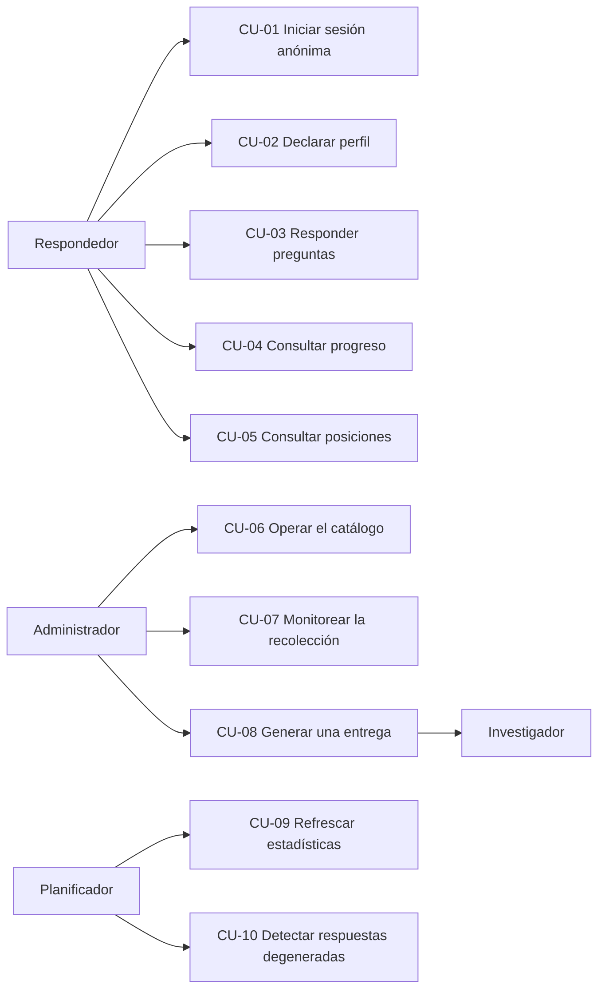

# 02 — Casos de uso

> Estado: **v1** · Última revisión: 31/08/2026

Actores del sistema y los flujos que ejecutan, con sus caminos alternativos y sus excepciones.
Cada caso de uso referencia los requerimientos que satisface.

---

## 1. Actores

| Actor | Quién es | Qué puede hacer |
|---|---|---|
| **Respondedor** | Jugador de LoL, anónimo, sin cuenta | Responder preguntas, ver su perfil y la tabla de posiciones |
| **Administrador** | El alumno durante la práctica | Operar el sistema: parches, pool, exportaciones, monitoreo |
| **Investigador** | Equipo del Laboratorio DHARMa | Recibir y consumir los CSV y el Informe de Calidad de Datos |
| **Planificador** | Los jobs programados del worker | Recalcular denormalizados, detectar patrones, chequear conectividad |

El **Investigador no interactúa con el sistema**: recibe archivos. Es un actor externo cuya única
interfaz es el CSV, y esa frontera es deliberada
([ADR-005](13-adr/ADR-005-alcance-medicion-de-campeones.md)).

---

## CU-01 — Iniciar sesión anónima

**Actor:** Respondedor · **Requerimientos:** RF-001 a RF-004 · **Precondición:** ninguna

**Flujo principal**

1. El respondedor abre la aplicación.
2. El cliente calcula una huella local y la envía junto con la petición de sesión.
3. El sistema crea un respondedor con trust score inicial 0.500 y devuelve el token en una cookie.
4. El cliente avanza al onboarding.

**Alternativo A — ya hay sesión.** Si llega una cookie válida, el sistema no crea identidad nueva,
actualiza `last_seen` y devuelve el progreso acumulado. El cliente salta directo a responder.

**Alternativo B — cookie borrada.** El sistema no puede reconocer al respondedor y crea uno nuevo.
Se pierden racha, perfil e historial. Es un costo aceptado de no tener registro.

**Excepción — base de datos no disponible.** El sistema devuelve `503` y el cliente muestra un
estado de error con reintento. No se permite responder sin sesión.

**Postcondición:** existe una fila en `respondents` y el navegador tiene una cookie válida.

---

## CU-02 — Declarar perfil de segmentación

**Actor:** Respondedor · **Requerimientos:** RF-005 · **Precondición:** sesión activa

**Flujo principal**

1. El sistema presenta rango, rol principal y horas semanales, con la explicación de para qué sirven.
2. El respondedor completa los que quiera.
3. El sistema los almacena y marca el onboarding como visto.

**Alternativo A — omitir.** El respondedor toca *Skip*. El sistema almacena los tres campos en nulo
y **marca igualmente el onboarding como visto**: omitir es una respuesta y no se vuelve a preguntar.

**Alternativo B — respuesta parcial.** Cualquier subconjunto es válido; los no respondidos quedan
nulos.

**Postcondición:** `onboarding_seen = true`. Los datos son variables de segmentación, nunca criterio
de calidad: el rango declarado no es verificable.

---

## CU-03 — Responder preguntas

**Actor:** Respondedor · **Requerimientos:** RF-101 a RF-114, RF-201 a RF-203, RF-209 ·
**Precondición:** sesión activa

Es el caso de uso central del sistema. Todo lo demás existe para sostenerlo.

**Flujo principal**

1. El cliente pide un lote de preguntas.
2. El sampler selecciona candidatas según su función de prioridad, respetando la mezcla de tipos,
   la cadencia de honeypots y la de retests.
3. El sistema devuelve las preguntas con sus enunciados ya compuestos.
4. El cliente muestra la primera tarjeta y cronometra desde que se pinta.
5. El respondedor elige una opción.
6. El cliente envía la respuesta con el tiempo transcurrido.
7. El sistema valida la forma contra el tipo de la pregunta, verifica el límite de tasa, registra la
   respuesta y actualiza los contadores del respondedor.
8. Si la pregunta era honeypot o retest, el sistema recalcula el trust score.
9. El sistema devuelve la distribución de respuestas de la comunidad y el progreso actualizado.
10. El cliente muestra el feedback 1,2 segundos y pasa a la siguiente tarjeta de la cola.
11. Cuando quedan dos preguntas en cola, el cliente vuelve al paso 1 en segundo plano.

**Alternativo A — soporte insuficiente.** Si la pregunta tiene menos de 20 respuestas, el sistema
omite el consenso y el cliente muestra que el respondedor está entre los primeros.

**Alternativo B — honeypot.** El flujo es idéntico y **el respondedor no percibe diferencia
alguna**. El sistema compara contra la respuesta esperada y actualiza los contadores de calidad.

**Alternativo C — retest.** El sistema presenta una pregunta ya respondida por ese mismo
respondedor hace 15 o más preguntas, marcando la nueva respuesta como repetición de la anterior.

**Alternativo D — cola vacía.** Si el sampler no encuentra candidatas, el sistema devuelve un lote
vacío y el cliente informa que no queda nada por preguntar.

**Excepción 1 — respuesta mal formada.** `400`. No se registra nada. El crudo es append-only, así
que un dato mal formado no se podría corregir después.

**Excepción 2 — respuesta duplicada.** `409`, impuesto por un índice único en la base. El cliente lo
descarta en silencio y avanza: tocar dos veces no debe verse como un error.

**Excepción 3 — límite de tasa excedido.** `429` con el tiempo de espera. El cliente pausa la sesión
con una cuenta regresiva.

**Excepción 4 — fallo de red.** La respuesta se pierde y se le informa al respondedor. **No se
encola para envío diferido**: un duplicado es peor que una pérdida.

**Postcondición:** una fila nueva en `responses`, contadores actualizados y, si correspondía, trust
score recalculado.

---

## CU-04 — Consultar progreso

**Actor:** Respondedor · **Requerimientos:** RF-302 · **Precondición:** sesión activa

El sistema muestra cantidad de respuestas, racha actual y mejor racha, tasa de acuerdo con la
comunidad, cobertura por tipo de pregunta y percentil de contribución.

**Nunca se muestra el trust score**, ni el resultado de los honeypots, ni ninguna señal derivada.
Exponerlos convertiría la calidad en una métrica a optimizar.

---

## CU-05 — Consultar la tabla de posiciones

**Actor:** Respondedor · **Requerimientos:** RF-303, RF-304 · **Precondición:** sesión activa

El sistema devuelve los 50 primeros por cantidad de respuestas en la ventana elegida, con alias
generados, resaltando al respondedor si aparece. Los marcados quedan excluidos.

Ordena por **cantidad y no por acuerdo**: premiar el acuerdo induciría a responder lo que se cree
popular en vez de lo que se cree cierto.

---

## CU-06 — Operar el catálogo

**Actor:** Administrador · **Requerimientos:** RF-403, RF-405, RF-601 a RF-606

**Flujo principal**

1. Sale un parche nuevo del juego.
2. El administrador ejecuta el seeder, que relee el catálogo de campeones desde Data Dragon.
3. El administrador registra el parche y lo marca como vigente.
4. El administrador carga el snapshot de pick rate del parche y ajusta los tiers del pool si
   corresponde.

**Alternativo A — promover tier.** Cuando el volumen acumulado lo permite, el administrador habilita
el tier siguiente. Es un cambio de datos, no un despliegue: cambia
`app_settings['sampler.enabled_pool_tiers']`, y el criterio numérico que lo justifica está en
[`21-sampler.md`](21-sampler.md) §7.2.

**Alternativo B — Data Dragon no disponible.** El seeder usa el snapshot local de respaldo y avisa.

**Postcondición:** las preguntas nuevas se generan contra el parche vigente y el pool actualizado.
Las preguntas y respuestas anteriores conservan su parche original. **Las cuatro acciones dejan una
fila en `admin_audit`** (RF-405).

---

## CU-07 — Monitorear la recolección

**Actor:** Administrador · **Requerimientos:** RF-401, RF-402, RF-404

El administrador consulta volumen por día y por tipo, cobertura por campeón y dimensión,
distribución del trust score, respondedores marcados y **estado de conectividad del grafo por
dimensión**.

Este último es el indicador que decide si el piloto va a producir datos utilizables: una dimensión
con el grafo partido no produce scores comparables entre sus componentes, y detectarlo tarde no
tiene arreglo.

---

## CU-08 — Generar una entrega

**Actor:** Administrador → **Investigador** · **Requerimientos:** RF-501 a RF-512

**Flujo principal**

1. El administrador dispara una corrida indicando ventana de parches, umbral de confianza, vida
   media del decaimiento y remuestreos del bootstrap.
2. El pipeline lee las respuestas de la ventana, excluyendo las de respondedores por debajo del
   umbral o marcados.
3. Ajusta los cinco modelos estadísticos y calcula intervalos por bootstrap.
4. Escribe los agregados y emite los tres CSV más el Informe de Calidad de Datos.
5. Registra una fila por archivo con su checksum y todos los parámetros de la corrida.
6. El administrador entrega los archivos al investigador.

**Alternativo A — grafo desconectado en una dimensión.** El pipeline no fuerza una solución: reporta
las componentes y marca esos scores como soporte insuficiente.

**Alternativo B — reanálisis con otro umbral.** Se vuelve a correr con otros parámetros. El crudo
está intacto, así que la corrida anterior sigue siendo reproducible.

**Excepción — corrida interrumpida.** No queda estado parcial visible: los agregados se escriben en
una transacción y la fila de exportación sólo se registra cuando el archivo está escrito y su
checksum calculado.

**Postcondición:** archivos entregados y trazables hasta las respuestas que los produjeron.

---

## CU-09 — Refrescar estadísticas de preguntas

**Actor:** Planificador · **Frecuencia:** cada 15 minutos

Recalcula exposición, distribución de respuestas y entropía de las preguntas del parche vigente.
Un solo recorrido alimenta a dos consumidores: el sampler, que necesita la entropía, y el feedback
post-respuesta, que necesita la distribución.

**Excepción — job detenido.** El sistema sigue operando con valores desactualizados: el sampler
pierde precisión progresivamente pero no falla.

---

## CU-10 — Detectar respuestas degeneradas

**Actor:** Planificador · **Frecuencia:** diaria · **Requerimientos:** RF-204, RF-208

Marca respuestas más rápidas que el umbral de lectura y rachas de *straightlining*, actualiza los
contadores de calidad y recalcula los trust scores afectados. Marca a los respondedores cuya huella
**creó** más de 5 identidades en las últimas 24 horas — se cuenta por `first_seen`, no por actividad,
porque la señal que interesa es la creación de identidades y no el uso de una máquina compartida
([`22-calidad-de-datos.md`](22-calidad-de-datos.md) §6).

**Ninguna respuesta se borra.** El efecto es siempre sobre pesos y marcas, nunca sobre el crudo
([ADR-002](13-adr/ADR-002-responses-append-only.md)).

---

## 2. Cobertura

| Actor | Casos de uso |
|---|---|
| Respondedor | CU-01, CU-02, CU-03, CU-04, CU-05 |
| Administrador | CU-06, CU-07, CU-08 |
| Planificador | CU-09, CU-10 |
| Investigador | CU-08 (como receptor) |

Todo requerimiento funcional de [`01-requerimientos.md`](01-requerimientos.md) queda cubierto por al
menos un caso de uso, salvo los agrupados como fuera de esta entrega.
