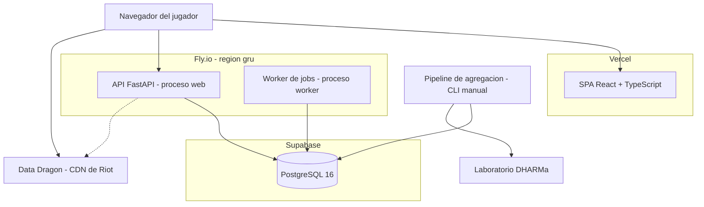

# 10 — Arquitectura

> Estado: **v1** · Última revisión: 31/08/2026

Describe los componentes del sistema, cómo se despliegan, qué hace cada uno y cómo se comunican.
Las decisiones que motivaron esta forma están en [`13-adr/`](13-adr/).

---

## 1. Vista de componentes

**Cinco piezas ejecutables**, con una responsabilidad cada una:

| Componente | Responsabilidad | Lo que NO hace |
|---|---|---|
| **SPA** | Presentar preguntas, capturar respuestas, mostrar feedback y perfil | No calcula nada estadístico ni conoce el sampler |
| **API** | Sesiones, entrega de preguntas, validación y registro de respuestas, trust score, perfil, leaderboard | No corre agregaciones ni jobs pesados |
| **Worker** | Recalcular valores denormalizados, detectar patrones degenerados, chequear conectividad del grafo | No atiende requests |
| **Pipeline de agregación** | Leer respuestas, ajustar los modelos estadísticos, escribir `aggregates` y emitir los CSV | No está desplegado ni expuesto: se ejecuta a demanda |
| **Base de datos** | Único estado del sistema | — |

El **worker es un proceso separado del API** en la misma app de Fly.io. El recálculo de entropía
recorre todas las respuestas del parche vigente; si corriera dentro del proceso web competiría con
el event loop que atiende `GET /questions/next`, que tiene presupuesto de 100 ms.

El **pipeline de agregación no se despliega**. Es un paquete Python que se corre desde la máquina
del desarrollador o desde una GitHub Action manual, contra la base de datos en modo lectura. Corre
unas pocas veces en toda la práctica —una por corte de datos— y ajustar Bradley-Terry sobre todas
las dimensiones lleva minutos, no milisegundos. Exponerlo como servicio sería infraestructura sin uso.

---

## 2. Vista de despliegue

| Entorno | Frontend | API + worker | Base de datos | Para qué |
|---|---|---|---|---|
| **local** | `vite dev` en `:5173` | `uvicorn --reload` en `:8000` | Postgres 16 en Docker | Desarrollo |
| **staging** | Preview de Vercel por rama | App `draftsense-api-staging` | Proyecto Supabase separado | Verificación de cada incremento |
| **producción** | `draftsense.dev` | `api.draftsense.dev` | Proyecto Supabase de producción | Piloto real |

Cada push a `main` despliega staging; producción se despliega por tag. El pipeline de CI corre
`ruff` + `mypy` + `pytest` sobre el backend, `eslint` + `tsc --noEmit` + `vitest` + `build` sobre
el frontend, y un smoke test de Playwright contra el preview.

**Staging y producción no comparten base de datos.** Las respuestas de prueba no deben poder
contaminar el dataset que se entrega al laboratorio.

---

## 3. Recorrido de una respuesta, punta a punta

Es el camino crítico del sistema. Todo lo demás existe para sostenerlo.

**1. Carga.** El navegador pide `draftsense.dev`. Vercel devuelve el bundle desde CDN.
Presupuesto: menos de 200 KB gzip.

**2. Sesión.** La SPA hace `POST /api/v1/sessions`. Si no hay cookie `ds_session` válida, la API
crea una fila en `respondents` con `trust_score = 0.500`, genera un token, guarda su SHA-256 y
devuelve el token en una cookie `HttpOnly; Secure; SameSite=Lax` de 180 días. Si ya había cookie,
la operación es idempotente y sólo actualiza `last_seen`.

**3. Onboarding.** Se muestran las tres preguntas de segmentación (rango, rol principal, horas
semanales) con un botón *Skip* visible. Si el usuario responde, `POST /api/v1/sessions/onboarding`;
si omite, los campos quedan en `NULL` y no vuelve a preguntarse.

**4. Cola de preguntas.** `GET /api/v1/questions/next?count=5`. El sampler selecciona cinco
preguntas leyendo **valores denormalizados** (`exposure_count`, `entropy`, `answer_counts`) sobre
un índice, nunca agregando en vivo. La SPA mantiene esa cola en memoria y vuelve a pedir cuando le
quedan dos, de modo que nunca hay espera visible entre tarjeta y tarjeta.

**5. Respuesta.** El usuario toca una opción. La SPA mide el tiempo desde que la tarjeta se pintó
y envía `POST /api/v1/responses` con `{question_id, answer, response_time_ms}`.

**6. Registro.** La API, en una transacción:

1. valida el `answer` contra el esquema JSON del tipo de la pregunta;
2. verifica el rate limit (40/min, 1500/día) contando sobre el índice `(respondent_id, created_at)`;
3. inserta en `responses` — **append-only**, nunca se modifica ni se borra;
4. actualiza los contadores mutables del respondedor: `answers_count`, `current_streak`,
   `answers_today`, `current_day_streak`, `last_seen`;
5. si la pregunta era honeypot o retest, actualiza los contadores de calidad y **recalcula `trust_score`**.

**7. Feedback.** La respuesta HTTP incluye la distribución de respuestas de esa pregunta, leída del
campo denormalizado `answer_counts`. Si el soporte es menor a 20 se omite, y la interfaz muestra
*"you're one of the first to answer this"* en lugar de anclar al usuario sobre ruido.

**8. Siguiente tarjeta.** La SPA anima la transición y muestra la próxima pregunta de la cola.
El usuario nunca espera a la red.

**Presupuesto de latencia:** `GET /questions/next` < 100 ms p95 · `POST /responses` < 150 ms p95.
Ambos son alcanzables porque ninguno hace agregaciones: leen y escriben filas indexadas.

---

## 4. Procesos de fondo

| Job | Frecuencia | Qué hace |
|---|---|---|
| `refresh_question_stats` | 15 min | Recalcula `exposure_count`, `answer_counts`, `entropy` y `coverage_deficit` de las preguntas del parche vigente. Alimenta al sampler y al feedback de consenso, y retira las honeypots cuyo *pass rate* cayó por debajo del umbral |
| `check_graph_connectivity` | 1 h | Calcula las componentes conexas del grafo de comparaciones por dimensión y marca las preguntas que unirían componentes separadas, para que el sampler las priorice |
| `detect_degenerate_patterns` | diario | Marca respuestas apuradas y rachas de *straightlining*; actualiza los contadores del respondedor y su `trust_score` |
| `flag_duplicate_fingerprints` | diario | Marca `is_flagged` a los respondedores cuyo `fingerprint_hash` **creó** más de 5 identidades en 24 h — se cuenta por `first_seen`, no por actividad |
| `seed_champions` | manual, por parche | Relee `champion.json` de Data Dragon y actualiza el catálogo |

**Por qué el consenso se denormaliza y no se calcula en vivo:** mostrar "74 % coincidió con vos"
requiere la distribución de respuestas de la pregunta. Calcularla en cada `POST` sería un `GROUP BY`
en el camino crítico. Con refresco cada 15 minutos el número puede estar levemente desactualizado,
lo cual es irrelevante para un mensaje motivacional, y el mismo job ya recorre esos datos para
calcular la entropía que necesita el sampler. Un solo recorrido sirve a los dos consumidores.

---

## 5. Límites del sistema

**Dentro:** la aplicación de etiquetado, la calidad de datos, la agregación estadística a nivel de
campeón y de par de campeones, y la exportación trazable.

**Fuera:** todo lo que tenga que ver con partidas. DraftSense no consume el dataset del laboratorio,
no construye features por partida, no se integra con el modelo predictivo y no interpreta resultados.
La frontera es el CSV. Ver [ADR-005](13-adr/ADR-005-alcance-medicion-de-campeones.md).

**Dependencias externas:** una sola, y no crítica — Data Dragon, para el catálogo y las imágenes de
campeones. Se consume en el seeder (unas pocas veces por parche) y desde el navegador del usuario
para los íconos. **No se usa la Riot Games API**: no hace falta clave ni cuota. El snapshot de pick
rate que define el pool de campeones se carga como seed versionado en el repositorio, no se consulta
en runtime ([ADR-006](13-adr/ADR-006-pool-escalonado-por-pick-rate.md)).

---

## 6. Restricciones estructurales

Cuatro reglas que atraviesan todo el diseño y no se negocian por conveniencia de implementación:

1. **`responses` es append-only.** Garantizado por permisos de Postgres, no por disciplina del
   código: el rol de aplicación tiene `INSERT` y `SELECT`, no `UPDATE` ni `DELETE`. Las correcciones
   de calidad se aplican como pesos en la agregación
   ([ADR-002](13-adr/ADR-002-responses-append-only.md)).
2. **Todo dato crudo se versiona por parche.** Una respuesta sólo tiene sentido junto al parche en
   que se dio. La agregación puede combinar parches con decaimiento, pero el crudo nunca pierde su
   `patch_id` ([ADR-004](13-adr/ADR-004-ventana-de-parches-con-decaimiento.md)).
3. **Los agregados son derivados y recalculables.** `aggregates` es caché: se puede truncar y
   reconstruir enteramente desde `responses`. Ninguna decisión del sistema depende de que sobreviva.
4. **`trust_score` es derivado, nunca ingresado.** Se recalcula desde las propias respuestas del
   respondedor y no se expone en ninguna API pública: mostrarlo invitaría a jugar con la métrica.

---

## 7. Qué pasa cuando algo falla

| Falla | Comportamiento |
|---|---|
| Base de datos caída | La API devuelve `503`; la SPA muestra un estado de error con reintento. Las respuestas de la cola local **no** se encolan para envío diferido: una respuesta sin registrar se pierde, y eso es preferible a duplicarla |
| Data Dragon inaccesible | Los íconos caen a un *placeholder* con las iniciales del campeón. El seeder tiene un snapshot local de respaldo |
| Worker detenido | El sistema sigue funcionando con valores denormalizados desactualizados: el sampler pierde precisión progresivamente pero no falla, y el feedback muestra números viejos |
| Rate limit excedido | `429` con `Retry-After`. La SPA pausa la sesión con un mensaje, no rompe |
| Agregación interrumpida | No queda estado parcial visible: escribe `aggregates` en una transacción y sólo registra la fila en `exports` cuando el archivo está escrito y su checksum calculado |
