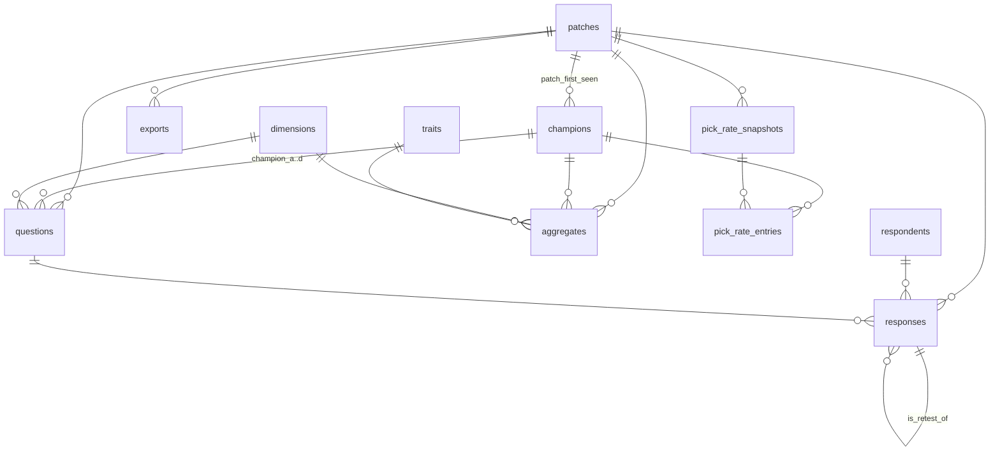

# 11 — Modelo de datos

> Estado: **v1** · Última revisión: 09/09/2026 · Motor: PostgreSQL 16

Esquema completo, diccionario de datos, esquemas de validación de las respuestas y estrategia de
migraciones. El DDL de este documento es **ejecutable tal cual**: se corre contra un Postgres 16
limpio y crea el esquema entero.

---

## 1. Principios

Cuatro reglas que explican por qué el esquema tiene esta forma:

1. **`responses` es append-only.** Una respuesta nunca se modifica ni se borra. Las correcciones de
   calidad se aplican como *pesos* en la agregación. Consecuencia directa: **la validación tiene que
   ser hermética en el `INSERT`**, porque un dato malo no se puede arreglar después. Por eso las
   restricciones de forma del `answer` viven en la base y no sólo en la capa de aplicación.
2. **Todo dato crudo se versiona por parche.** Una respuesta sólo tiene sentido junto al parche en
   que se dio. La agregación puede combinar parches con decaimiento; el crudo nunca pierde su `patch_id`.
3. **Los agregados son derivados y recalculables.** `aggregates` es caché materializada: se puede
   truncar y reconstruir enteramente desde `responses`.
4. **Lo denormalizado es siempre reconstruible.** `exposure_count`, `answer_counts`, `entropy` y
   `trust_score` son cachés de cálculos sobre `responses`. Si se pierden, un job los rehace.

---

## 2. Diagrama



---

## 3. DDL

### 3.1 Extensiones y tipos

```sql
CREATE EXTENSION IF NOT EXISTS pgcrypto;   -- gen_random_uuid(), digest()

CREATE TYPE question_type AS ENUM (
    'pairwise_dimension',   -- tipo 1: quién tiene más <dimensión>
    'peak_timing',          -- tipo 2: en qué minuto llega a su pico
    'lane_matchup',         -- tipo 3: quién gana el 1v1 de línea
    'duo_synergy',          -- tipo 4: qué dupla funciona mejor
    'trait_multiselect'     -- tipo 5: qué atributos cumple
);

CREATE TYPE aggregate_scope AS ENUM (
    'champion_dimension',   -- score por (campeón, dimensión)
    'champion_peak',        -- minuto de pico por campeón
    'matchup_pair',         -- ventaja de línea 1v1 por (campeón_a, campeón_b, rol)
    'duo_synergy',          -- sinergia interna de una dupla
    'duo_lane_strength',    -- fuerza de una dupla en el enfrentamiento 2v2
    'champion_trait'        -- proporción por (campeón, atributo)
);

CREATE TYPE support_level AS ENUM ('solid', 'limited', 'insufficient');

-- Roles individuales: los que ocupa un campeón
CREATE TYPE lane_role AS ENUM ('top', 'jungle', 'mid', 'adc', 'support');

-- Contextos de dupla: dónde dos campeones actúan juntos.
-- Es un enum aparte y no un valor más de lane_role porque 'bot' no es un rol
-- que ocupe un campeón, sino una pareja de roles (adc + support).
CREATE TYPE duo_context AS ENUM ('bot', 'top_jungle', 'mid_jungle');
```

### 3.2 `patches`

```sql
CREATE TABLE patches (
    patch_id    serial PRIMARY KEY,
    version     text    NOT NULL UNIQUE,
    released_at date    NOT NULL,
    is_current  boolean NOT NULL DEFAULT false,
    CONSTRAINT patches_version_format CHECK (version ~ '^\d+\.\d+$')
);

-- A lo sumo un parche vigente a la vez.
CREATE UNIQUE INDEX patches_single_current ON patches (is_current) WHERE is_current;
```

### 3.3 `champions`

```sql
CREATE TABLE champions (
    champion_id      serial PRIMARY KEY,
    riot_key         text        NOT NULL UNIQUE,   -- 'Alistar' — clave de Data Dragon
    riot_name        text        NOT NULL,          -- 'Alistar'
    display_name     text        NOT NULL,          -- lo que se muestra en la UI
    roles            lane_role[] NOT NULL DEFAULT '{}',
    image_url        text        NOT NULL,
    patch_first_seen int         NOT NULL REFERENCES patches (patch_id),
    pool_tier        smallint    NOT NULL DEFAULT 3,
    is_active        boolean     NOT NULL DEFAULT true,
    CONSTRAINT champions_pool_tier_range CHECK (pool_tier BETWEEN 1 AND 3),
    CONSTRAINT champions_has_roles       CHECK (cardinality(roles) > 0)
);

CREATE INDEX champions_active_pool ON champions (pool_tier) WHERE is_active;
CREATE INDEX champions_roles_gin   ON champions USING gin (roles);
```

`pool_tier` implementa el pool escalonado: **1** = núcleo inicial (~40 campeones), **2** = expansión
(~80), **3** = el resto. El sampler sólo genera preguntas sobre los tiers habilitados. Promover un
campeón es un `UPDATE`, no un deploy. Ver [ADR-006](13-adr/ADR-006-pool-escalonado-por-pick-rate.md).

### 3.4 `pick_rate_snapshots` y `pick_rate_entries`

La evidencia detrás de `pool_tier`: se toma una vez por parche a mano y se versiona en el repo.

```sql
CREATE TABLE pick_rate_snapshots (
    snapshot_id serial PRIMARY KEY,
    source      text NOT NULL,           -- 'lolalytics' | 'u.gg'
    source_url  text NOT NULL,
    captured_at date NOT NULL,
    patch_id    int  NOT NULL REFERENCES patches (patch_id),
    notes       text,
    CONSTRAINT pick_rate_snapshots_unique UNIQUE (source, patch_id, captured_at)
);

CREATE TABLE pick_rate_entries (
    snapshot_id  int       NOT NULL REFERENCES pick_rate_snapshots (snapshot_id) ON DELETE CASCADE,
    champion_id  int       NOT NULL REFERENCES champions (champion_id),
    role         lane_role NOT NULL,
    pick_rate    numeric(6,4) NOT NULL,
    rank_in_role int       NOT NULL,
    PRIMARY KEY (snapshot_id, champion_id, role),
    CONSTRAINT pick_rate_range CHECK (pick_rate >= 0 AND pick_rate <= 1)
);
```

### 3.5 `dimensions`

Las 8 dimensiones funcionales del tipo 1. **Agregar una dimensión es insertar una fila**: no
requiere deploy ni migración.

```sql
CREATE TABLE dimensions (
    dimension_id   serial   PRIMARY KEY,
    code           text     NOT NULL UNIQUE,
    label_en       text     NOT NULL,
    label_es       text,
    description_en text     NOT NULL,
    description_es text,
    prompt_en      text     NOT NULL,
    prompt_es      text,
    display_order  smallint NOT NULL DEFAULT 0,
    is_active      boolean  NOT NULL DEFAULT true,
    CONSTRAINT dimensions_code_format CHECK (code ~ '^[a-z][a-z0-9_]{1,30}$')
);
```

| `code` | `label_en` | Significado |
|---|---|---|
| `engage` | Engage | Capacidad de iniciar peleas |
| `poke` | Poke | Daño a distancia sostenido |
| `pick` | Pick potential | Potencial de aislar y matar un objetivo |
| `peel` | Peel | Capacidad de proteger a un aliado |
| `mobility` | Mobility | Desplazamientos y escapes |
| `scaling` | Scaling | Cuánto mejora con oro y niveles |
| `cc` | Crowd control | Cantidad y confiabilidad del control de masas |
| `waveclear` | Waveclear | Velocidad de limpieza de oleadas |

`prompt_en` guarda el enunciado completo de la pregunta y no se compone desde `label_en`, porque
los enunciados no siguen una plantilla: `scaling` pregunta *"Who scales better?"*, no *"Who has
more scaling?"*. Componerlos en código obligaría a un caso especial por dimensión, que es
exactamente lo que esta tabla existe para evitar.

Los campos en español son nulos hasta la internacionalización de la semana 8
([ADR-010](13-adr/ADR-010-interfaz-en-ingles.md)).

### 3.6 `traits`

Los atributos del tipo 5. `legacy_tag` marca las 7 etiquetas originales del laboratorio, que son
las que hacen comparable el modelo nuevo contra el previo.

```sql
CREATE TABLE traits (
    trait_id       serial   PRIMARY KEY,
    code           text     NOT NULL UNIQUE,
    label_en       text     NOT NULL,
    label_es       text,
    description_en text     NOT NULL,
    description_es text,
    legacy_tag     boolean  NOT NULL DEFAULT false,
    display_order  smallint NOT NULL DEFAULT 0,
    is_active      boolean  NOT NULL DEFAULT true,
    CONSTRAINT traits_code_format CHECK (code ~ '^[a-z][a-z0-9_]{1,30}$')
);
```

### 3.7 `respondents`

```sql
CREATE TABLE respondents (
    respondent_id         uuid PRIMARY KEY DEFAULT gen_random_uuid(),
    session_token_hash    text NOT NULL UNIQUE,
    fingerprint_hash      text NOT NULL,

    -- Onboarding (los tres opcionales: NULL = prefirió no decir u omitió)
    declared_rank         text,
    declared_main_role    lane_role,
    declared_hours_bucket text,
    onboarding_seen       boolean NOT NULL DEFAULT false,

    -- Calidad (derivados, nunca ingresados)
    trust_score       numeric(4,3) NOT NULL DEFAULT 0.500,
    honeypot_attempts int NOT NULL DEFAULT 0,
    honeypot_passed   int NOT NULL DEFAULT 0,
    retest_pairs      int NOT NULL DEFAULT 0,
    retest_consistent int NOT NULL DEFAULT 0,
    fast_answers      int NOT NULL DEFAULT 0,
    straightline_runs int NOT NULL DEFAULT 0,

    -- Gamificación
    answers_count      int  NOT NULL DEFAULT 0,
    current_streak     int  NOT NULL DEFAULT 0,
    best_streak        int  NOT NULL DEFAULT 0,
    answers_today      int  NOT NULL DEFAULT 0,
    last_active_date   date,
    current_day_streak int  NOT NULL DEFAULT 0,
    best_day_streak    int  NOT NULL DEFAULT 0,
    alias              text,

    first_seen timestamptz NOT NULL DEFAULT now(),
    last_seen  timestamptz NOT NULL DEFAULT now(),
    is_flagged boolean     NOT NULL DEFAULT false,

    CONSTRAINT respondents_trust_range CHECK (trust_score BETWEEN 0 AND 1),
    CONSTRAINT respondents_rank_valid CHECK (
        declared_rank IS NULL OR declared_rank IN (
            'iron','bronze','silver','gold','platinum','emerald',
            'diamond','master','grandmaster','challenger','unranked'
        )
    ),
    CONSTRAINT respondents_hours_valid CHECK (
        declared_hours_bucket IS NULL
        OR declared_hours_bucket IN ('<5','5-15','15-30','30+')
    ),
    CONSTRAINT respondents_counters_consistent CHECK (
        honeypot_passed       <= honeypot_attempts
        AND retest_consistent <= retest_pairs
        AND current_streak    <= best_streak
        AND current_day_streak <= best_day_streak
    )
);

CREATE INDEX respondents_fingerprint ON respondents (fingerprint_hash);
CREATE INDEX respondents_leaderboard ON respondents (answers_count DESC)
    WHERE NOT is_flagged;
```

**Las dos rachas miden cosas distintas.** `current_streak` cuenta respuestas seguidas sin una pausa
de más de 30 minutos: es el motor intra-sesión. `current_day_streak` cuenta días consecutivos con al
menos 5 respuestas: es el motor entre sesiones, y es el que sostiene la recolección a lo largo de las
cuatro semanas del piloto. `answers_today` y `last_active_date` son el estado mínimo para llevar la
segunda sin consultar `responses` en el camino crítico; son reconstruibles desde el crudo. Ver
[`23-gamificacion.md`](23-gamificacion.md) §2.

**Ninguna recompensa depende del contenido de la respuesta**, sólo del volumen y de la constancia.
Una racha por coincidir con el consenso rompería la independencia entre anotadores, que es un
supuesto del alfa de Krippendorff y del modelo de Bradley-Terry.

**Privacidad.** No se guarda IP en claro, ni email, ni nombre, ni identificador de cuenta de Riot.
El sistema no tiene login. `fingerprint_hash` es SHA-256 de user-agent + hash de IP + resolución de
pantalla; es irreversible y su único uso es deduplicación. Ver `33-privacidad-y-legal.md`.

### 3.8 `questions`

Una fila por pregunta concreta —un par o una combinación específica—, no por plantilla.

```sql
CREATE TABLE questions (
    question_id  bigserial PRIMARY KEY,
    type         question_type NOT NULL,

    champion_a int NOT NULL REFERENCES champions (champion_id),
    champion_b int          REFERENCES champions (champion_id),
    champion_c int          REFERENCES champions (champion_id),
    champion_d int          REFERENCES champions (champion_id),

    dimension_id int         REFERENCES dimensions (dimension_id),
    role         lane_role,    -- variantes 1v1: quién ocupa ese rol
    duo_ctx      duo_context,  -- variantes de dupla: dónde actúan juntos
    patch_id     int NOT NULL REFERENCES patches (patch_id),

    is_honeypot     boolean NOT NULL DEFAULT false,
    expected_answer jsonb,

    -- Denormalizados, mantenidos por refresh_question_stats
    exposure_count    int     NOT NULL DEFAULT 0,
    answer_counts     jsonb   NOT NULL DEFAULT '{}'::jsonb,
    entropy           numeric(5,4),
    coverage_deficit  numeric(5,4),
    bridge_priority   boolean NOT NULL DEFAULT false,
    stats_refreshed_at timestamptz,

    created_at timestamptz NOT NULL DEFAULT now(),

    -- Cada tipo usa exactamente los campos que le corresponden.
    -- lane_matchup tiene DOS variantes: el 1v1 de línea (top/mid/adc) y el 2v2 de bot.
    CONSTRAINT questions_shape CHECK (
        CASE type
            WHEN 'pairwise_dimension' THEN
                champion_b IS NOT NULL AND champion_c IS NULL AND champion_d IS NULL
                AND dimension_id IS NOT NULL AND role IS NULL AND duo_ctx IS NULL
            WHEN 'peak_timing' THEN
                champion_b IS NULL AND champion_c IS NULL AND champion_d IS NULL
                AND dimension_id IS NULL AND role IS NULL AND duo_ctx IS NULL
            WHEN 'lane_matchup' THEN
                dimension_id IS NULL AND (
                    -- variante 1v1: A contra B en un rol
                    (champion_b IS NOT NULL AND champion_c IS NULL AND champion_d IS NULL
                     AND role IS NOT NULL AND role IN ('top','mid','adc') AND duo_ctx IS NULL)
                    OR
                    -- variante 2v2: la dupla (A,B) contra la dupla (C,D) en bot
                    (champion_b IS NOT NULL AND champion_c IS NOT NULL AND champion_d IS NOT NULL
                     AND role IS NULL AND duo_ctx = 'bot')
                )
            WHEN 'duo_synergy' THEN
                champion_b IS NOT NULL AND champion_c IS NOT NULL AND champion_d IS NOT NULL
                AND dimension_id IS NULL AND role IS NULL AND duo_ctx IS NOT NULL
            WHEN 'trait_multiselect' THEN
                champion_b IS NULL AND champion_c IS NULL AND champion_d IS NULL
                AND dimension_id IS NULL AND role IS NULL AND duo_ctx IS NULL
        END
    ),

    -- Orden canónico: (A,B) y (B,A) son la MISMA pregunta y no deben duplicarse.
    -- En las variantes de dupla se ordena dentro de cada pareja y entre parejas.
    CONSTRAINT questions_canonical_order CHECK (
        CASE
            WHEN type = 'pairwise_dimension' THEN champion_a < champion_b
            WHEN type = 'lane_matchup' AND champion_c IS NULL THEN champion_a < champion_b
            WHEN type IN ('lane_matchup','duo_synergy') THEN
                champion_a < champion_b AND champion_c < champion_d AND champion_a < champion_c
            ELSE true
        END
    ),

    CONSTRAINT questions_honeypot_has_expected CHECK (
        NOT is_honeypot OR expected_answer IS NOT NULL
    ),
    CONSTRAINT questions_entropy_range CHECK (entropy IS NULL OR entropy BETWEEN 0 AND 1),
    CONSTRAINT questions_coverage_range CHECK (
        coverage_deficit IS NULL OR coverage_deficit BETWEEN 0 AND 1
    )
);

-- Identidad de una pregunta: impide generar duplicados desde el sampler.
-- NULLS NOT DISTINCT (Postgres 15+) hace que dos filas con los mismos NULL choquen,
-- que es lo que se quiere: una pregunta de tipo 1 no usa role ni duo_ctx.
-- La alternativa con COALESCE(role::text, '') no es valida: castear un enum a text es
-- STABLE, no IMMUTABLE, y Postgres lo rechaza en la expresion de un indice. Ademas un
-- indice por expresion solo lo usa el planificador si la consulta repite la expresion.
CREATE UNIQUE INDEX questions_identity ON questions (
    type, patch_id, champion_a, champion_b, champion_c, champion_d,
    dimension_id, role, duo_ctx
) NULLS NOT DISTINCT;

-- Camino del sampler: filtra por tipo y parche, ordena por exposición
CREATE INDEX questions_sampler ON questions (type, patch_id, exposure_count)
    WHERE NOT is_honeypot;

CREATE INDEX questions_honeypots ON questions (patch_id) WHERE is_honeypot;
CREATE INDEX questions_bridges   ON questions (patch_id, dimension_id) WHERE bridge_priority;
```

`answer_counts` guarda la distribución observada, por ejemplo `{"a": 231, "b": 74, "unknown": 12}`.
La lee el feedback post-respuesta y de ella se deriva `entropy`.

`coverage_deficit` es el tercer término de la función de prioridad del sampler: cuánto le falta al
campeón peor cubierto de esta pregunta para llegar a la mediana global de cobertura. Está
denormalizado por la misma razón que `entropy`: `GET /questions/next` tiene 100 ms de presupuesto y
no puede hacer un `GROUP BY` sobre `responses`. Ver [`21-sampler.md`](21-sampler.md) §3.3.

`bridge_priority` lo marca el job `check_graph_connectivity`: indica que esa pregunta uniría dos
componentes desconectadas del grafo de comparaciones y por lo tanto vale mucho más que su escasez
sugiere ([ADR-008](13-adr/ADR-008-conectividad-por-componentes.md)).

### 3.9 `responses`

El corazón del sistema y la única tabla que importa conservar intacta.

```sql
CREATE TABLE responses (
    response_id      bigserial PRIMARY KEY,
    respondent_id    uuid   NOT NULL REFERENCES respondents (respondent_id),
    question_id      bigint NOT NULL REFERENCES questions (question_id),
    type             question_type NOT NULL,   -- denormalizado desde questions
    patch_id         int    NOT NULL REFERENCES patches (patch_id),
    answer           jsonb  NOT NULL,
    response_time_ms int    NOT NULL,
    is_retest_of     bigint REFERENCES responses (response_id),
    created_at       timestamptz NOT NULL DEFAULT now(),

    CONSTRAINT responses_time_sane CHECK (response_time_ms >= 0 AND response_time_ms < 600000),

    -- Validación de forma del answer. Vive en la base porque responses es append-only:
    -- un dato mal formado no se puede corregir después.
    CONSTRAINT responses_answer_shape CHECK (
        CASE type
            WHEN 'pairwise_dimension' THEN
                (answer ->> 'choice') IN ('a','b','unknown')
                AND (answer - 'choice') = '{}'::jsonb
            WHEN 'peak_timing' THEN
                jsonb_typeof(answer -> 'minute') = 'number'
                AND (answer -> 'minute') >= '0'::jsonb
                AND (answer -> 'minute') <= '40'::jsonb
                AND (answer - 'minute') = '{}'::jsonb
            WHEN 'lane_matchup' THEN
                (answer ->> 'choice') IN ('a_strong','a_slight','even','b_slight','b_strong')
                AND (answer - 'choice') = '{}'::jsonb
            WHEN 'duo_synergy' THEN
                (answer ->> 'choice') IN ('pair_1','pair_2','similar')
                AND (answer - 'choice') = '{}'::jsonb
            WHEN 'trait_multiselect' THEN
                jsonb_typeof(answer -> 'traits') = 'array'
                AND (answer - 'traits') = '{}'::jsonb
        END
    )
);

-- Un respondedor responde cada pregunta una sola vez, salvo que sea un retest deliberado
CREATE UNIQUE INDEX responses_one_per_question
    ON responses (respondent_id, question_id)
    WHERE is_retest_of IS NULL;

-- Agregación y estadísticas por pregunta
CREATE INDEX responses_by_question ON responses (question_id, created_at);

-- Rate limiting, historial del perfil y detección de straightlining
CREATE INDEX responses_by_respondent ON responses (respondent_id, created_at DESC);

-- Recorridos del pipeline de agregación por ventana de parches
CREATE INDEX responses_by_patch_type ON responses (patch_id, type);

-- Ventanas de día y semana de la tabla de posiciones
CREATE INDEX responses_recent ON responses (created_at DESC);
```

Dos campos son **redundantes a propósito**: `type` y `patch_id` ya se pueden deducir de
`questions`. Se copian porque (a) permiten expresar la validación del `answer` como restricción de
tabla, que de otro modo requeriría un JOIN imposible en un `CHECK`, y (b) el pipeline de agregación
recorre respuestas por parche y tipo sin tocar `questions`. La consistencia la garantiza la capa de
aplicación en el `INSERT`; una migración de verificación puede auditarla con un `JOIN`.

**El rango de `response_time_ms`** corta en 10 minutos: por encima de eso la tarjeta quedó abierta
en una pestaña olvidada y el tiempo no mide nada.

### 3.10 `aggregates`

Caché materializada del resultado de la agregación. Truncable y reconstruible.

```sql
CREATE TABLE aggregates (
    aggregate_id  bigserial PRIMARY KEY,
    scope         aggregate_scope NOT NULL,
    champion_id   int NOT NULL REFERENCES champions (champion_id),
    champion_b_id int          REFERENCES champions (champion_id),
    dimension_id  int          REFERENCES dimensions (dimension_id),
    trait_id      int          REFERENCES traits (trait_id),
    role          lane_role,
    duo_ctx       duo_context,
    patch_id      int NOT NULL REFERENCES patches (patch_id),

    value   numeric(9,5) NOT NULL,
    ci_low  numeric(9,5),
    ci_high numeric(9,5),

    n_responses   int NOT NULL,
    n_comparisons int,
    support       support_level NOT NULL,
    method        text NOT NULL,   -- 'bradley_terry_ilsr', 'weighted_median_bootstrap', ...

    patch_window text NOT NULL,    -- '16.18..16.20' — qué parches entraron
    computed_at  timestamptz NOT NULL DEFAULT now(),

    CONSTRAINT aggregates_ci_ordered CHECK (
        ci_low IS NULL OR ci_high IS NULL OR ci_low <= ci_high
    ),
    CONSTRAINT aggregates_scope_shape CHECK (
        CASE scope
            WHEN 'champion_dimension' THEN
                champion_b_id IS NULL AND dimension_id IS NOT NULL
                AND trait_id IS NULL AND role IS NULL AND duo_ctx IS NULL
            WHEN 'champion_peak' THEN
                champion_b_id IS NULL AND dimension_id IS NULL
                AND trait_id IS NULL AND role IS NULL AND duo_ctx IS NULL
            WHEN 'matchup_pair' THEN
                champion_b_id IS NOT NULL AND dimension_id IS NULL
                AND trait_id IS NULL AND role IS NOT NULL AND duo_ctx IS NULL
            WHEN 'duo_synergy' THEN
                champion_b_id IS NOT NULL AND dimension_id IS NULL
                AND trait_id IS NULL AND role IS NULL AND duo_ctx IS NOT NULL
            WHEN 'duo_lane_strength' THEN
                champion_b_id IS NOT NULL AND dimension_id IS NULL
                AND trait_id IS NULL AND role IS NULL AND duo_ctx = 'bot'
            WHEN 'champion_trait' THEN
                champion_b_id IS NULL AND dimension_id IS NULL
                AND trait_id IS NOT NULL AND role IS NULL AND duo_ctx IS NULL
        END
    ),

    -- Las entidades pareadas se guardan en forma canónica
    CONSTRAINT aggregates_canonical_pair CHECK (
        champion_b_id IS NULL OR champion_id < champion_b_id
    )
);

CREATE UNIQUE INDEX aggregates_identity ON aggregates (
    scope, champion_id, champion_b_id, dimension_id, trait_id,
    role, duo_ctx, patch_id
) NULLS NOT DISTINCT;
```

`support` traduce `n_comparisons` y el ancho del intervalo a un juicio legible por el laboratorio,
sin excluir nada del CSV ([ADR-011](13-adr/ADR-011-support-level-en-vez-de-excluir.md)). Los umbrales
concretos están en [`26-esquema-de-salida.md`](26-esquema-de-salida.md).

### 3.11 `exports`

Trazabilidad de cada archivo entregado: qué respuestas lo produjeron, con qué parámetros y cuándo.

```sql
CREATE TABLE exports (
    export_id  serial PRIMARY KEY,
    patch_id   int  NOT NULL REFERENCES patches (patch_id),
    file_name  text NOT NULL,
    file_kind  text NOT NULL,
    sha256     text NOT NULL,

    row_count          int NOT NULL,
    column_count       int NOT NULL,
    responses_included int NOT NULL,
    respondents_included int NOT NULL,

    -- Parámetros de la corrida: sin esto el CSV no es reproducible
    min_trust_applied   numeric(4,3) NOT NULL,
    patch_window        text NOT NULL,
    decay_halflife_days numeric(6,2),
    bootstrap_samples   int,
    aggregation_version text NOT NULL,   -- versión del paquete draftsense_agg

    created_at timestamptz NOT NULL DEFAULT now(),

    CONSTRAINT exports_kind_valid CHECK (
        file_kind IN ('champion_features','matchup_matrix','duo_features','quality_report')
    ),
    CONSTRAINT exports_sha256_format CHECK (sha256 ~ '^[0-9a-f]{64}$')
);

CREATE INDEX exports_by_patch ON exports (patch_id, created_at DESC);
```

### 3.12 `app_settings`

Los parámetros operativos del sistema. **Ninguno es una constante del código** (RF-606).

```sql
CREATE TABLE app_settings (
    key        text  PRIMARY KEY,
    value      jsonb NOT NULL,
    updated_at timestamptz NOT NULL DEFAULT now(),
    updated_by text,
    CONSTRAINT app_settings_key_format CHECK (key ~ '^[a-z][a-z0-9_]*\.[a-z][a-z0-9_]*$')
);
```

Existe porque tres documentos ya prometían que estos valores fueran configurables sin desplegar, y no
había dónde guardarlos: `enabled_pool_tiers` ([ADR-006](13-adr/ADR-006-pool-escalonado-por-pick-rate.md)),
los umbrales de 5 y 20 del arranque en frío —que [ADR-012](13-adr/ADR-012-sampler-uniforme-en-arranque-en-frio.md)
declara explícitamente "parámetros de configuración, no constantes en el código"—, los umbrales de
`support_level` ([ADR-011](13-adr/ADR-011-support-level-en-vez-de-excluir.md)), la `σ` de la curva de
poder y la `ε` del sampler.

Claves iniciales, por bloque:

| Prefijo | Claves | Documento que las define |
|---|---|---|
| `sampler.` | `enabled_pool_tiers`, `epsilon`, `weights`, `cold_threshold`, `consensus_threshold`, `candidate_limit`, `max_rejection_retries` | [`21-sampler.md`](21-sampler.md) §9 |
| `quality.` | `honeypot_every`, `honeypot_min_pass_rate`, `retest_every`, `retest_min_distance`, `fast_answer_ms`, `straightline_run`, `fingerprint_max_identities`, `trust_weights`, `trust_smoothing` | [`22-calidad-de-datos.md`](22-calidad-de-datos.md) §8 |
| `gamification.` | `streak_gap_minutes`, `day_streak_min_answers`, `streak_timezone`, `leaderboard_size`, `leaderboard_cache_seconds` | [`23-gamificacion.md`](23-gamificacion.md) §7 |
| `export.` | `min_trust` | [`22-calidad-de-datos.md`](22-calidad-de-datos.md) §8 |
| `aggregation.` | `decay_halflife_days`, `bootstrap_samples`, `power_sigma`, `bt_prior`, `duo_lambda_champion`, `duo_lambda_interaction`, `max_iter`, `tol`, `support_thresholds`, `segment_min_respondents`, `segment_min_comparisons` | [`25-agregacion.md`](25-agregacion.md) §9 |

El formato del `key` obliga a `bloque.nombre`: sin el punto, la tabla degenera en un cajón de sastre
en tres semanas.

> **Corregido el 09/09/2026.** La primera redacción de esta tabla agrupaba bajo `export.` los
> parámetros del pipeline. [`25-agregacion.md`](25-agregacion.md) §9 —escrito después y más
> específico— los define bajo el prefijo `aggregation.`, y renombra `power_curve_sigma` a
> `power_sigma`. En `export.` queda sólo `min_trust`, que es la clave que ADR-014 obliga a
> compartir entre el filtro de exportación y la tabla de posiciones. Manda §9; esta tabla se
> alineó a ella. El seed de `infra/seeds/app_settings.yaml` usa estos nombres.

**El valor de cada corrida de exportación se copia a `exports`**, no se lee de acá al reproducirla.
`app_settings` es el estado actual; `exports` es el registro histórico. Reproducir una corrida vieja
con los parámetros de hoy daría un archivo distinto y rompería RNF-08.

La aplicación cachea la tabla **60 segundos** en memoria: son unas 30 filas que se leen en cada
petición y cambian dos veces por semana.

### 3.13 `admin_audit`

Toda acción de administración deja rastro.

```sql
CREATE TABLE admin_audit (
    audit_id   bigserial PRIMARY KEY,
    action     text  NOT NULL,
    payload    jsonb NOT NULL DEFAULT '{}'::jsonb,
    created_at timestamptz NOT NULL DEFAULT now(),
    CONSTRAINT admin_audit_action_valid CHECK (
        action IN ('activate_patch', 'set_pool_tier', 'set_enabled_tiers',
                   'set_setting', 'flag_respondent', 'trigger_export')
    )
);

CREATE INDEX admin_audit_recent ON admin_audit (created_at DESC);
```

Es append-only por la misma razón que `responses`: un registro de auditoría que se puede editar no
es un registro de auditoría. No guarda quién —el panel se autentica con una clave compartida
(`X-Admin-Key`), no con identidades— sino **qué cambió y cuándo**, que es lo que hace falta para
explicar por qué dos corridas del pipeline sobre el mismo crudo dieron distinto.

---

## 4. Permisos: cómo se garantiza el append-only

No alcanza con que el código no borre. Se garantiza con permisos, de modo que ni un bug ni una
consola abierta puedan romperlo:

```sql
CREATE ROLE draftsense_app LOGIN PASSWORD :'app_password';

GRANT CONNECT ON DATABASE draftsense TO draftsense_app;
GRANT USAGE  ON SCHEMA public TO draftsense_app;

-- Lectura general
GRANT SELECT ON ALL TABLES IN SCHEMA public TO draftsense_app;

-- Escritura sólo donde corresponde
GRANT INSERT                 ON responses   TO draftsense_app;
GRANT INSERT, UPDATE         ON respondents TO draftsense_app;
GRANT INSERT, UPDATE         ON questions   TO draftsense_app;
GRANT USAGE ON ALL SEQUENCES IN SCHEMA public TO draftsense_app;

-- Configuración: la aplicación la lee, sólo el panel la escribe
GRANT UPDATE, INSERT ON app_settings TO draftsense_app;
GRANT INSERT ON admin_audit TO draftsense_app;

-- Explícito, aunque no se haya otorgado: responses no se modifica ni se borra
REVOKE UPDATE, DELETE, TRUNCATE ON responses FROM draftsense_app;

-- El registro de auditoría tampoco se reescribe
REVOKE UPDATE, DELETE, TRUNCATE ON admin_audit FROM draftsense_app;

-- El pipeline de agregación usa un rol propio, de sólo lectura sobre el crudo
CREATE ROLE draftsense_agg LOGIN PASSWORD :'agg_password';
GRANT CONNECT ON DATABASE draftsense TO draftsense_agg;
GRANT USAGE   ON SCHEMA public TO draftsense_agg;
GRANT SELECT  ON ALL TABLES IN SCHEMA public TO draftsense_agg;
GRANT INSERT, UPDATE, DELETE ON aggregates TO draftsense_agg;  -- es caché: se puede reconstruir
GRANT INSERT  ON exports    TO draftsense_agg;
```

Las migraciones corren con el rol dueño del esquema, distinto de los dos anteriores.

---

## 5. Esquemas de validación del `answer`

La restricción de tabla asegura la forma. La capa de aplicación (Pydantic v2) agrega lo que SQL no
puede expresar cómodamente: que `minute` sea entero y que cada código de `traits` exista en la tabla
`traits` y esté activo.

| Tipo | `answer` | Validación adicional en la API |
|---|---|---|
| `pairwise_dimension` | `{"choice": "a" \| "b" \| "unknown"}` | — |
| `peak_timing` | `{"minute": 27}` | entero, no decimal |
| `lane_matchup` | `{"choice": "a_strong" \| "a_slight" \| "even" \| "b_slight" \| "b_strong"}` | — |
| `duo_synergy` | `{"choice": "pair_1" \| "pair_2" \| "similar"}` | — |
| `trait_multiselect` | `{"traits": ["engage", "dive"]}` | códigos existentes y activos, sin repetidos |

**Las dos variantes de `lane_matchup` comparten la forma del `answer`.** En el 1v1, `a` y `b` son
campeones; en el 2v2 de bot, son duplas. La escala de cinco niveles y el modelo de agregación son
los mismos: lo único que cambia es qué entidad compite. Por eso el 2v2 es una variante del tipo 3
y no un sexto tipo de pregunta.

`{"traits": []}` es una respuesta **válida y significativa**: quiere decir "ninguno de estos".
No se confunde con no haber respondido, porque una no-respuesta no genera fila.

`expected_answer` de los honeypots usa exactamente la misma forma que `answer`, de modo que la
comparación es una igualdad de `jsonb`.

---

## 6. Consultas críticas y sus índices

| Consulta | Cuándo | Índice que la sostiene |
|---|---|---|
| Candidatas del sampler por tipo y parche | cada `GET /questions/next` | `questions_sampler` |
| Rate limit del respondedor en la última hora | cada `POST /responses` | `responses_by_respondent` |
| Distribución de respuestas de una pregunta | job cada 15 min | `responses_by_question` |
| Barrido de la ventana de parches por tipo | pipeline de agregación | `responses_by_patch_type` |
| Top 50 del leaderboard, ventana total | cada `GET /leaderboard?window=all` | `respondents_leaderboard` |
| Top 50 del leaderboard, día y semana | `GET /leaderboard`, cacheado 60 s | `responses_recent` |
| Identidades por fingerprint en 24 h | job diario | `respondents_fingerprint` |

**El rate limit no necesita infraestructura extra.** Se resuelve contando sobre
`responses_by_respondent`, que ya existe:

```sql
SELECT count(*) FROM responses
WHERE respondent_id = $1 AND created_at > now() - interval '1 minute';
```

Con el índice, es un recorrido de unas pocas decenas de filas. No hace falta Redis ni un contador
en memoria, lo que además evita que el límite se reinicie en cada despliegue.

---

## 7. Migraciones

Alembic, una migración por cambio lógico, nombradas `NNNN_verbo_objeto.py`
(`0001_initial_schema.py`, `0002_add_pool_tier.py`).

Reglas:

1. **Nunca se elimina ni se cambia el tipo de una columna de `responses`.** Es el dato irremplazable
   del proyecto. Si un campo deja de usarse, se deja de escribir; no se borra.
2. Toda migración tiene `downgrade()` implementado y probado en local.
3. Los seeds no van en migraciones: viven en `infra/seeds/` como archivos versionados
   (`dimensions.yaml`, `traits.yaml`, `pick_rate_16.20.csv`) y se cargan con un comando propio,
   idempotente por `code` o por `riot_key`.
4. Las migraciones se aplican a staging desde CI en cada push a `main`, y a producción por tag,
   siempre antes de desplegar la aplicación.

---

## 8. Dimensionamiento

Con el pool inicial de 40 campeones (`pool_tier = 1`):

| Tabla | Filas esperadas al cierre del piloto | Notas |
|---|---|---|
| `champions` | ~170 | Catálogo completo; sólo 40 habilitados al inicio |
| `dimensions` / `traits` | 8 / 7 | |
| `questions` | 10 000 – 15 000 | Generadas perezosamente por el sampler, no precomputadas |
| `respondents` | 500 – 3 000 | |
| `responses` | 1 000 (piso comprometido) – 8 000 (meta de trabajo) | ~250 B por fila → menos de 2 MB |
| `aggregates` | ~2 000 | 40 campeones × (8 dimensiones + 1 pico + 7 atributos) + pares |
| `exports` | ~20 | 4 archivos × 5 corridas |
| `app_settings` | ~30 | Una fila por parámetro operativo |
| `admin_audit` | ~100 | Una fila por acción del panel |

El total queda holgadamente por debajo de los 500 MB del plan gratuito de Supabase; el margen es
superior al 99 %. **El cuello de botella del proyecto no es el almacenamiento: es conseguir
respuestas suficientes para que los intervalos de confianza sean angostos.**

El producto cartesiano completo de pares por dimensión es del orden de 10⁵ con el catálogo entero,
imposible de cubrir. Por eso las preguntas se generan bajo demanda sobre el pool habilitado, y por
eso Bradley-Terry es la elección correcta: **estima un score por campeón a partir de comparaciones
parciales**, sin necesitar que todos los pares se hayan observado
([ADR-003](13-adr/ADR-003-bradley-terry.md)).
