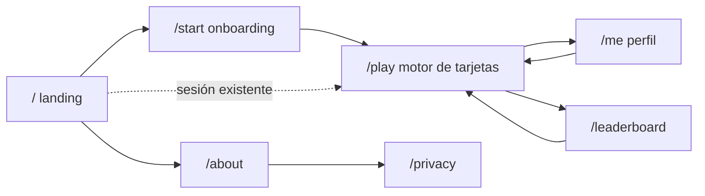

# 30 — Flujos e interfaz

> Estado: **v1** · Última revisión: 31/08/2026

Mapa de navegación, maquetado de cada pantalla, estados y microcopy. Todo el texto de esta
especificación es el literal que ve el usuario, en inglés
([ADR-010](13-adr/ADR-010-interfaz-en-ingles.md)).

---

## 1. El principio que gobierna todo

**Cada paso entre abrir el enlace y responder la primera pregunta cuesta respuestas.** El riesgo
número uno del proyecto es la participación insuficiente, y la interfaz es la principal palanca
sobre ese riesgo.

De ahí salen tres reglas que ninguna pantalla viola:

1. **Nunca se pide algo antes de dar algo.** No hay registro, no hay muro, no hay email.
2. **La respuesta es el estado por defecto.** Si el usuario no hace nada más que tocar, la app
   funciona: onboarding salteable, perfil opcional, leaderboard opcional.
3. **Nada bloquea la siguiente tarjeta.** La cola se precarga; el usuario nunca espera a la red.

---

## 2. Mapa de navegación



Cinco rutas públicas más `/admin`, que no se enlaza desde ninguna parte.

**El camino principal es `/` → `/start` → `/play` y termina ahí.** Perfil y leaderboard son ramas
laterales a las que se llega desde la barra inferior durante el juego, y de las que siempre se
vuelve con un botón grande.

---

## 3. `/` — Landing

Una sola pantalla, sin scroll en un teléfono típico.

```
┌─────────────────────────────┐
│                             │
│        DRAFTSENSE           │
│                             │
│   Help rank every champion  │
│   in League of Legends.     │
│                             │
│   Quick questions. No       │
│   account. 2 minutes.       │
│                             │
│   ┌───────────────────┐     │
│   │      Start        │     │
│   └───────────────────┘     │
│                             │
│   Your answers feed public  │
│   research at UTN Mendoza.  │
│                             │
│   About · Privacy           │
└─────────────────────────────┘
```

| Elemento | Texto |
|---|---|
| Título | `DRAFTSENSE` |
| Promesa | `Help rank every champion in League of Legends.` |
| Fricción | `Quick questions. No account. 2 minutes.` |
| Acción | `Start` |
| Propósito | `Your answers feed public research at UTN Mendoza.` |

La tercera línea existe porque **el motivo del proyecto es parte del gancho**: la gente responde
encuestas de internet cuando entiende para qué sirven. Nombrar la universidad y la investigación
convierte "otro quiz de LoL" en algo con destino.

Si ya hay cookie de sesión válida, el botón dice `Continue` y salta directo a `/play`.

---

## 4. `/start` — Onboarding

Tres preguntas en una pantalla, con **omitir siempre visible**.

```
┌─────────────────────────────┐
│  A bit about you        Skip│
│  Optional. It helps us      │
│  compare answers across     │
│  skill levels.              │
│                             │
│  Your rank                  │
│  [Iron][Bronze][Silver]     │
│  [Gold][Plat][Emerald]      │
│  [Diamond][Master+]         │
│  [I don't play ranked]      │
│                             │
│  Main role                  │
│  [Top][Jungle][Mid]         │
│  [Bot][Support][Fill]       │
│                             │
│  Hours per week             │
│  [<5][5-15][15-30][30+]     │
│                             │
│   ┌───────────────────┐     │
│   │     Continue      │     │
│   └───────────────────┘     │
└─────────────────────────────┘
```

`Skip` arriba a la derecha llama a `POST /sessions/onboarding` con los tres campos en `null`: omitir
también es una respuesta, y así no se vuelve a preguntar.

La segunda línea explica **por qué** se pregunta. Sin ella, tres preguntas personales antes de
empezar se leen como un formulario; con ella, como una contribución.

Ninguna respuesta es obligatoria: se puede tocar `Continue` con los tres vacíos.

---

## 5. `/play` — Motor de tarjetas

La pantalla donde se pasa el 95 % del tiempo. El maquetado de cada tipo está en
[`20-tipos-de-pregunta.md`](20-tipos-de-pregunta.md); acá va el marco que las contiene.

```
┌─────────────────────────────┐
│  🔥 7      18 answered      │  ← barra superior
├─────────────────────────────┤
│                             │
│      [ tarjeta del tipo ]   │
│                             │
├─────────────────────────────┤
│   Play    Profile    Ranks  │  ← barra inferior
└─────────────────────────────┘
```

**Barra superior:** racha actual y contador de respuestas. Nada más — ni tiempo, ni porcentaje, ni
nivel. Todo lo que se agregue ahí compite con la tarjeta.

**Barra inferior:** tres destinos, siempre visibles, sin menú desplegable.

### 5.1 Feedback post-respuesta

Al responder, la tarjeta no salta de inmediato: se superpone el resultado durante **1,2 segundos** y
luego entra la siguiente.

```
┌─────────────────────────────┐
│      ✓  74% agree with you  │
│                             │
│   Alistar  ████████░░  74%  │
│   Yasuo    ██░░░░░░░░  19%  │
│   Not sure █░░░░░░░░░   7%  │
│                             │
│        312 answers          │
└─────────────────────────────┘
```

Con soporte insuficiente (`sample_size < 20`):

```
┌─────────────────────────────┐
│   ⚡ You're one of the       │
│      first to answer this   │
└─────────────────────────────┘
```

**Este es el gancho de retención principal.** La comparación con el consenso es lo que convierte
responder preguntas en algo con recompensa inmediata, y es la razón por la que alguien contesta 40
en vez de 5. El caso de soporte bajo se trata con un mensaje positivo y no con un vacío, porque
durante los primeros días **todas** las preguntas van a caer ahí.

| Situación | Texto |
|---|---|
| Coincide con la mayoría | `74% agree with you` |
| No coincide | `You're in the 19%` |
| Soporte bajo | `You're one of the first to answer this` |
| Racha en múltiplo de 10 | `10 in a row 🔥` sobre el feedback normal |
| Tipo 2 (mediana) | `Most players said 26 min. You said 27.` |

`You're in the 19%` está redactado deliberadamente **sin connotación de error**. No hay respuesta
correcta: la discrepancia es el dato, no una falla del usuario. Decir "wrong" arruinaría tanto la
motivación como la calidad de las respuestas siguientes.

---

## 6. `/me` — Perfil

```
┌─────────────────────────────┐
│         brave-poro-4417     │
│                             │
│    143        12       31   │
│  answers    streak    best  │
│                             │
│   You agree with the        │
│   community 78% of the time │
│                             │
│   Top 9% of contributors    │
│                             │
│   What you've answered      │
│   Champion pairs      96    │
│   Power spikes        21    │
│   Lane matchups       18    │
│   Duos                 5    │
│   Traits               3    │
│                             │
│   ┌───────────────────┐     │
│   │   Keep playing    │     │
│   └───────────────────┘     │
└─────────────────────────────┘
```

**No se muestra el trust score**, ni ninguna señal derivada de él, ni el resultado de los honeypots.
Exponerlo convertiría la calidad en un juego a optimizar en vez de una consecuencia de responder
honestamente ([ADR-002](13-adr/ADR-002-responses-append-only.md)).

---

## 7. `/leaderboard` — Tabla de posiciones

```
┌─────────────────────────────┐
│  This week ▾                │
│                             │
│  1  brave-poro-4417    412  │
│  2  calm-baron-0091    389  │← resaltado si es el usuario
│  3  swift-drake-7720   365  │
│  …                          │
│                             │
│  You're #2 this week        │
│   ┌───────────────────┐     │
│   │   Keep playing    │     │
│   └───────────────────┘     │
└─────────────────────────────┘
```

Selector de ventana: `Today` · `This week` · `All time`. Top 50.

Ordena por **cantidad de respuestas**, no por acuerdo ni por precisión. Premiar el acuerdo
empujaría a responder lo que se cree popular en vez de lo que se cree cierto, que es exactamente el
sesgo que arruinaría los datos.

---

## 8. Estados de cada pantalla

| Estado | Cuándo | Qué se muestra |
|---|---|---|
| **Carga inicial** | Primer render de `/play` | Esqueleto de la tarjeta, sin *spinner* centrado. La forma de la tarjeta ya visible reduce la sensación de espera |
| **Carga entre tarjetas** | Nunca visible | La cola se precarga cuando quedan 2 preguntas |
| **Cola vacía** | El sampler no devuelve candidatas | `Nothing left to ask right now. Come back after the next patch.` con enlace al perfil |
| **Sin conexión** | `navigator.onLine === false` o fallo de red | `You're offline. Your last answer wasn't saved.` con botón `Retry` |
| **Base caída (503)** | La API responde 503 | `Something broke on our end. Try again in a minute.` con `Retry` |
| **Rate limit (429)** | Excedió el límite | `Slow down a little — try again in {n} seconds.` con cuenta regresiva |
| **Pregunta duplicada (409)** | Carrera de doble toque | Se descarta en silencio y se avanza a la siguiente. El usuario no debe ver un error por tocar dos veces |
| **Sesión perdida** | Cookie borrada | Vuelve a `/` sin mensaje de error; se crea una sesión nueva de forma transparente |

**Las respuestas no se encolan para envío diferido.** Si una respuesta no se registra, se pierde y
se le dice al usuario. Reintentar automáticamente al recuperar la conexión arriesga duplicados y
respuestas dadas en un contexto que ya pasó; con datos crudos append-only, un duplicado es peor que
una pérdida ([ADR-002](13-adr/ADR-002-responses-append-only.md)).

---

## 9. Accesibilidad y diseño responsivo

- **Móvil primero.** El diseño base es de 360 px de ancho; el escritorio es el caso derivado, con la
  tarjeta centrada y ancho máximo de 640 px.
- **Área táctil mínima de 44 px** en toda opción seleccionable.
- **Contraste AA** en todo texto sobre fondo.
- **Navegación por teclado** en escritorio: `1`–`5` seleccionan opción, `?` abre la definición,
  `Enter` confirma en los tipos que lo requieren.
- **El color nunca es el único portador de información**: las opciones se distinguen por posición y
  etiqueta, no por color.
- Los íconos de campeón llevan `alt` con el nombre del campeón.

---

## 10. Decisiones de interfaz que quedaron cerradas

| Decisión | Elegido | Por qué |
|---|---|---|
| Registro | No hay | Máxima conversión ([ADR-001](13-adr/ADR-001-sin-autenticacion.md)) |
| Onboarding | Al inicio, salteable | Segmentación completa desde la primera respuesta, con salida visible |
| Confirmación de respuesta | Sólo tipos 2 y 5 | Los demás registran al primer toque; un slider y una multi-selección no tienen "primer toque" que valga |
| Duración del feedback | 1,2 s | Suficiente para leer el porcentaje, corto para no romper el ritmo |
| Orden del leaderboard | Cantidad de respuestas | Premiar acuerdo induciría a responder lo popular |
| Trust score visible | No | Convertiría la calidad en una métrica a optimizar |
| Deshacer una respuesta | No existe | `responses` es append-only y una corrección tardía es peor dato que la primera reacción |
